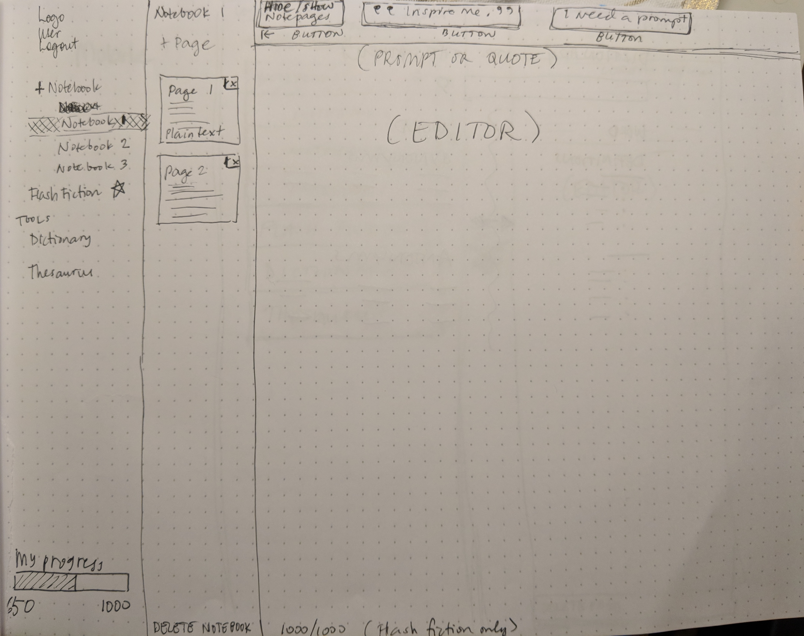

## "Word Seed" | Thinkful Node Capstone
Sow words across the blank white page, invite the creative Muse for a quick romp with a writing prompt, and allow new vocabulary to take root in memory with Word Seed, a writing goal app that is designed for writers who want to exercise their mind, hone their skills, and expand their vocabulary. Users can set a goal, see their progress, and create different notebooks to fit their creative needs.

#### Screenshots
|  Login  | Notebook   |  Dictionary  |  Thesaurus  |  Progress  |
| -- | -- | -- | -- | -- |
|  |  |   |  |  |

#### User Cases
Writing -- The app is open for any type of writing be it creative, general note-taking, or general writing. The notebook feature is there to divide up topics according to the user's wants.

#### User Stories
* Users should have a way to login so that they can access their profile and data
* Users should have the ability to perform the following CRUD operations to read or modify data:
    * create a notebook
    * retrieve a notebook
    * update notebook
    * delete a notebook
* Users should have a progress bar so they can keep track of their goal.
* Users should have an autosave feature so that their writing is persisted automatically.
* Users should have a dictionary and thesaurus so that they can expand their vocabulary.
* Users should opt to get a quote or prompt when they need inspiration for their writing.
* Users should get a “CONGRATULATE” message when they meet their writing goal so that they can reuse the app and set a new goal.
* Users should be able to change their profile settings.

#### User Flow & Wireframe
|  userflow  | dashboard   |  dashboard mobile  |  dictionary/thesaurus  |
| -- | -- | -- | -- |
|  |  |   | 

#### Working Prototype
[Demo](https://writers-challenge.herokuapp.com/)

#### Functionality
The app's functionality includes:

* Users have the ability to create an account that stores information unique to them
    * Users can update their address and writing goal number
* User can read, add, update, and delete notebooks
* Users can get a writing prompt
* Users can look up words in a dictionary and thesaurus
* Users can see their writing goal progress

#### Technology
Frontend: HTML5 | CSS3 | JavaScript ES6 | jQuery  
Backend: Node.js | Express.js | Mocha | Chai | RESTful API Endpoints | MongoDB | Mongoose

#### Responsive
App is responsive across most mobile, tablet, laptop, and desktop screen resolutions.

#### Development Roadmap
This is v1.0 of the app, but future enhancements may include:

* Pages for each Notebook
* Inspirational quotes and serious writing prompts
    * Pick genres